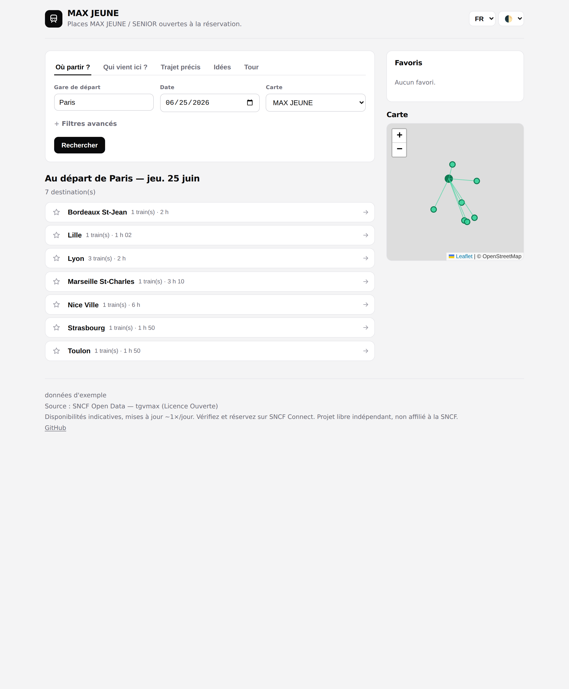
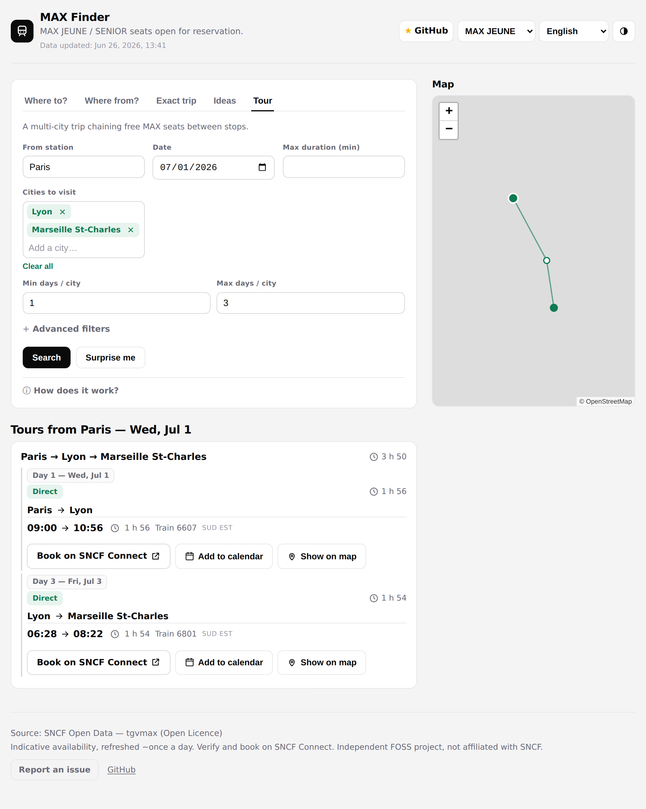
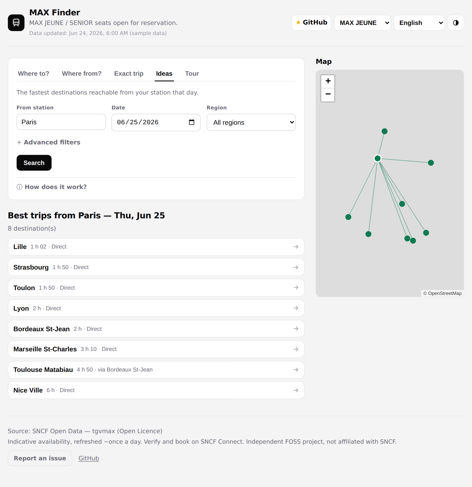
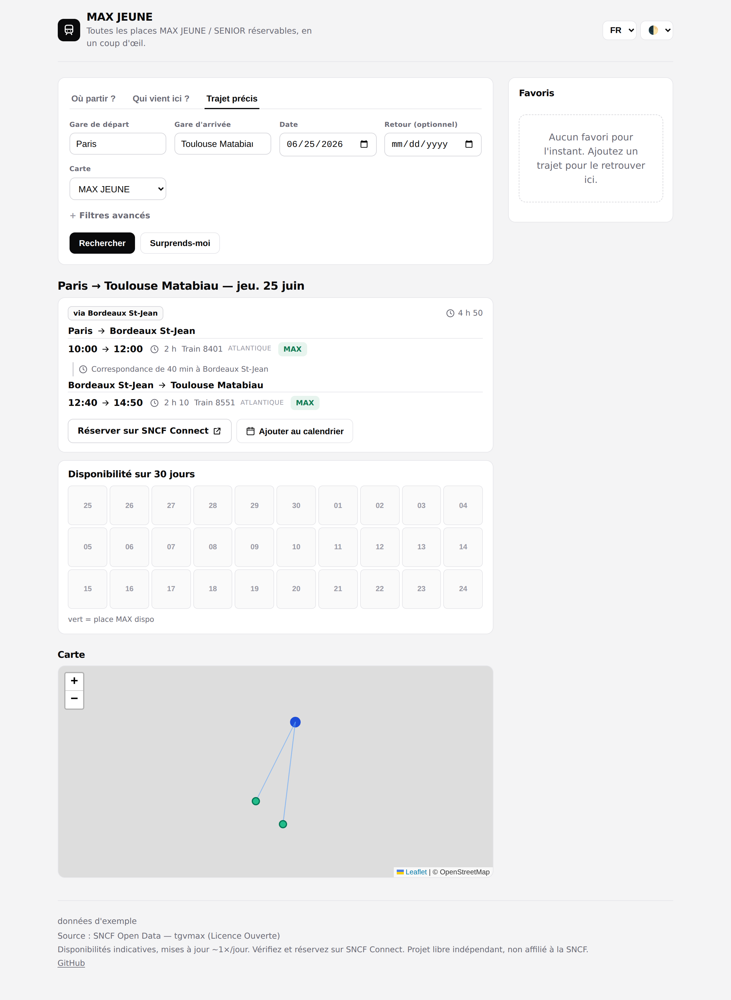
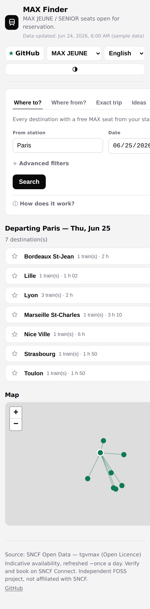
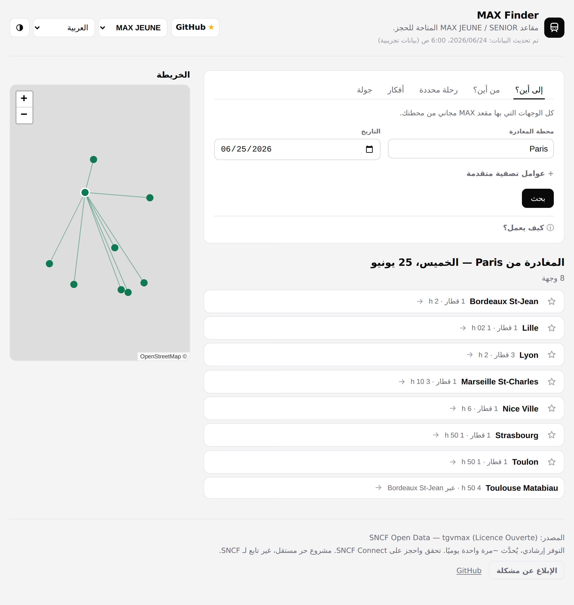

# MAX Finder

**Find every SNCF train where a free MAX JEUNE / MAX SENIOR (ex-TGVmax) seat is actually reservable — instead of checking SNCF Connect one route at a time.**

### ▶ [**Try it live — davd-gzl.github.io/MAX-Finder**](https://davd-gzl.github.io/MAX-Finder/) — no signup, runs in your browser

With a MAX JEUNE or MAX SENIOR pass, high-speed trains are free — but only when a MAX seat is still open on that train. SNCF Connect makes you check one route at a time; MAX Finder shows every station you can reach for free from a single search, using SNCF's open availability data.

Free, no account, open-source, and serverless — it runs entirely in your browser.

> Independent open-source tool — **not affiliated with SNCF, not a ticket seller**. Availability is indicative and refreshed ~daily; always confirm and book on [SNCF Connect](https://www.sncf-connect.com/).

---

## See it

| | |
| --- | --- |
| [](docs/screenshots/from.png) | [](docs/screenshots/tour.png) |
| **Where to?** — everywhere you can go, ranked by availability | **Tour** — chain several cities into one free itinerary |
| [](docs/screenshots/best.png) | [](docs/screenshots/trip.png) |
| **Ideas** — fastest destinations that day | **Exact trip** — exact route + 30-day calendar |

<p>
  
  
</p>

---

## Search modes

- **Where to?** — every destination reachable from a station, ranked by availability.
- **Where from?** — the reverse: every origin that reaches a destination.
- **Exact trip** — one origin → destination, with connections, a 30-day availability calendar, and a round-trip finder.
- **Ideas** — the fastest destinations reachable that day.
- **Tour** — a multi-city, day-by-day itinerary, each hop on a free MAX seat.

## Features

| | |
| --- | --- |
| **Connections** | Multi-leg up to 6 changes via hubs, optional **Via** stopover, overnight-stopover mode |
| **Round trips & night trains** | Round trips pair the earliest-arriving outbound with the latest feasible return to maximize time there; night mode covers genuine *Intercités de Nuit* only |
| **Filters** | Time window, max duration, MAX JEUNE vs SENIOR, train type, region |
| **Map** | Leaflet map of every station, with correspondences plotted as intermediate points; click to select |
| **Search & share** | Explicit run (`Enter`/`g`), back nav (`Esc`), **Surprise me** random city, ICS calendar export, shareable URLs |
| **Private by default** | No accounts — favorites, settings and searches in `localStorage`; optional local notifications |
| **Everywhere** | 11 languages (FR EN ES DE IT KO ZH JA NL PT AR, incl. RTL), light/dark, installable app that works offline, mobile, accessible |

---

## Why it's free

Which trains have a free MAX seat is published by SNCF as open data. MAX Finder is a static frontend over it:

- A scheduled **GitHub Action** snapshots the dataset each morning into `public/data/tgvmax.json`, keeping only the trains with a free seat (~77 MB feed trimmed to ~6 MB).
- The **browser** downloads that file and runs the search on your device; it can also query the SNCF API directly as a fallback.
- Everything is static files on **GitHub Pages** — no backend, no database, no server cost.

## Develop

**Prereqs:** Node 20+ and npm (CI runs Node 22).

```bash
npm install
npm run dev      # http://localhost:5173  (uses the committed data snapshot if present, else fixture)
npm test         # unit tests, no network needed
npm run build    # type-check + static build -> dist/
npm run verify   # render gate: the built app mounts (home + exact-trip + tour), no blank page
npm run test:e2e # end-to-end user journeys in headless Chromium against dist/ (needs build first)
```

The full check suite (`build` → `test` → `verify` → `test:e2e`) also runs in CI on every
pull request and push to `main` (`.github/workflows/test.yml`), and gates the Pages deploy.

<details>
<summary><strong>Repository layout</strong> — where each piece of logic lives</summary>

```
public/data/ committed daily snapshot (tgvmax.json + meta.json), served at /data/
data/        station registry + a small fixture for dev/tests
src/core     pure search / connections / calendar logic (unit-tested)
src/data     dataset loading + station lookup (+ DatasetProfile seam)
src/ui       rendering (search form, results, map, calendar)
scripts/     fetch-data.ts (daily Action) + verify-render.mjs + e2e.mjs + screenshot.mjs
tests/       unit tests (vitest)
.github/     ci (test) + update-data (cron) + deploy (Pages) workflows
docs/        how-it-works.md, algorithms.md (plain-language guides) + screenshots
specs/       constitution.md (guiding principles)
```

</details>

## Docs & roadmap

- **[How it works](docs/how-it-works.md)** — plain-language tour of the app, its data, and why it runs free with no server or account.
- **[Algorithms](docs/algorithms.md)** — how it actually finds trains (free-seat filter, connections, one-pass sweeps, round trips, tours, station naming) with diagrams.
- **[Vision / roadmap](VISION.md)** — V1 today is SNCF, done well; V2 adds Deutsche Bahn, Renfe and more of Europe into the same search. Principles in [`specs/constitution.md`](./specs/constitution.md).

## Mobile app (Capacitor)

The same static app is wrapped as a native Android/iOS app with
[Capacitor](https://capacitorjs.com/). The native build uses base `/` (assets
load from the app bundle, not the GitHub Pages sub-path), the service worker is
skipped on native, and the Android hardware back button navigates in-app history.

```bash
npm run cap:sync          # build for native (base "/") + copy assets & plugins into the platform
npx cap open android      # open in Android Studio to run / build an APK/AAB
```

The `android/` native project is already committed, so there's nothing to
generate first. (If it's ever deleted, `npm run cap:add:android` regenerates it.)

Requires the Android SDK / Android Studio to compile — the web build itself
needs only Node. To add iOS: `npm i @capacitor/ios && npx cap add ios`.

### Releases & F-Droid

Publishing a **GitHub Release** triggers the
[`Release Android APK`](.github/workflows/release-apk.yml) workflow, which builds
the app, signs it with the configured keystore and attaches the APK to the release
(it fails early if the keystore secrets are not set). The app is also packaged for
**F-Droid**, which builds and signs from source. Signing setup, the per-release version bump, and the F-Droid build
recipe are documented in **[docs/FDROID.md](docs/FDROID.md)**.

Contributions welcome — fork, `npm install`, `npm test`, then open a PR; principles in [`specs/constitution.md`](./specs/constitution.md).

## For agents / data API

Machine-readable and serverless — [`llms.txt`](public/llms.txt) and [`api.json`](public/api.json) describe the data + query API for AI agents.

- **Availability** — the deployed site serves `/data/tgvmax.json` (records where `od_happy_card: "OUI"` means a free MAX seat is reservable), plus `/data/meta.json` and `/data/stations.json`.
- **Deep-link search** — build a URL with `?mode=&from=&to=&date=&conn=…` (modes: `from`, `to`, `od`, `tour`, `best`). Full parameter list in [`api.json`](public/api.json).

## Data & license

**Data:** [SNCF Open Data — Disponibilité à 30 jours de places MAX JEUNE et MAX SENIOR](https://ressources.data.sncf.com/explore/dataset/tgvmax/information/) (the `tgvmax` dataset), licensed under the [Licence Ouverte / Open Licence](https://www.etalab.gouv.fr/licence-ouverte-open-licence). Availability is updated roughly once a day and is **indicative** — always confirm and book on [SNCF Connect](https://www.sncf-connect.com/). This project does not sell tickets and is not affiliated with SNCF.

**Code:** [MPL-2.0](./LICENSE).
