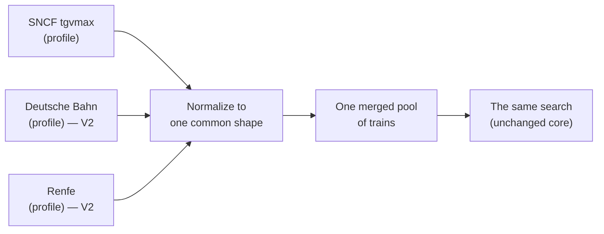

# Vision — MAX Finder

Where MAX Finder is today, and where it's headed. For the day-to-day of *how it
works now*, see [`docs/how-it-works.md`](docs/how-it-works.md) and
[`docs/algorithms.md`](docs/algorithms.md). The non-negotiable principles live in
[`specs/constitution.md`](specs/constitution.md).

---

## Today (V1): SNCF, done well

MAX Finder finds SNCF trains where a free **MAX JEUNE / MAX SENIOR** seat is
reservable, from SNCF open data — Where to?, Where from?, Exact trip, Tour, Ideas,
round trips and night trains, all serverless and account-free. **This is and stays
the heart of the app**, and the branding stays SNCF / MAX.

The data layer already has the seam V2 builds on: a **`DatasetProfile`**
(`src/data/profile.ts`) that holds everything about *reading and judging one
dataset* (field mapping, the "is this seat bookable?" rule, hubs, non-bookable
stops). The core search only ever sees the neutral, normalized train shape.

---

## The V2 goal: trains beyond France 🇫🇷 → 🇪🇺

Add other countries' trains — **Germany (Deutsche Bahn), Spain (Renfe), …** — so one
app covers more of Europe. SNCF remains the centre; other networks are added as
**extra data sources merged into the same search**, not a rewrite. A traveller
should be able to plan a trip that crosses a border without leaving the app.

### Why it's within reach

The core algorithms (search, connections, round trips, tours) already run on a
neutral `MaxTrain` shape, and the V1 `DatasetProfile` seam means **a new operator is
"another profile", not new core code**. The shape of V2 is mostly at the edges:
loading several sources and merging them, plus some UI honesty about what each
train is.

---

## What V2 needs (the phases)

1. **Hubs through the profile.** Connections currently default to the French hub
   list; make each source contribute its own interchange hubs.
2. **Merge multiple sources into one pool.** Load SNCF + DB + … together and
   normalize them into a single searchable set (instead of one profile at a time).
3. **Define "bookable" for a non-MAX operator.** DB and Renfe have no MAX seat, so
   each source decides what to highlight — e.g. "the train runs", a saver fare, or
   its own pass concept — and the UI shows that honestly.
4. **Foreign stations + cross-border rules.** Add coordinates for foreign stations
   for the map, and revisit `NON_BOOKABLE_PATTERNS` (today it *excludes* Geneva,
   Brussels, etc. — with more countries, some of those become bookable).
5. **UI treatment of non-MAX trains.** A clear label / badge so a German or Spanish
   train isn't mistaken for a free MAX seat, plus optional per-operator filters.

---

## Open questions (to settle when V2 starts)

- **What counts as "available / highlighted"** for each non-MAX operator?
- **Where does each country's data come from** — is there suitable open data (like
  SNCF's `tgvmax`) for DB, Renfe, etc., and under what licence?
- **Station coordinates** for foreign stations (for the map and distance sorting).
- **Cross-border connections** — which foreign stations act as hubs, and how to keep
  the connection search fast across a bigger network.
- **Booking links** — a per-operator "book this" target instead of one SNCF Connect
  deep link.

---

## Principles that don't change (V1 → V2)

Whatever we add, the app stays **serverless, free forever, account-free, and
private** — everything runs in the browser on static files, refreshed by scheduled
jobs, with favourites and settings never leaving the device. See
[`specs/constitution.md`](specs/constitution.md).
