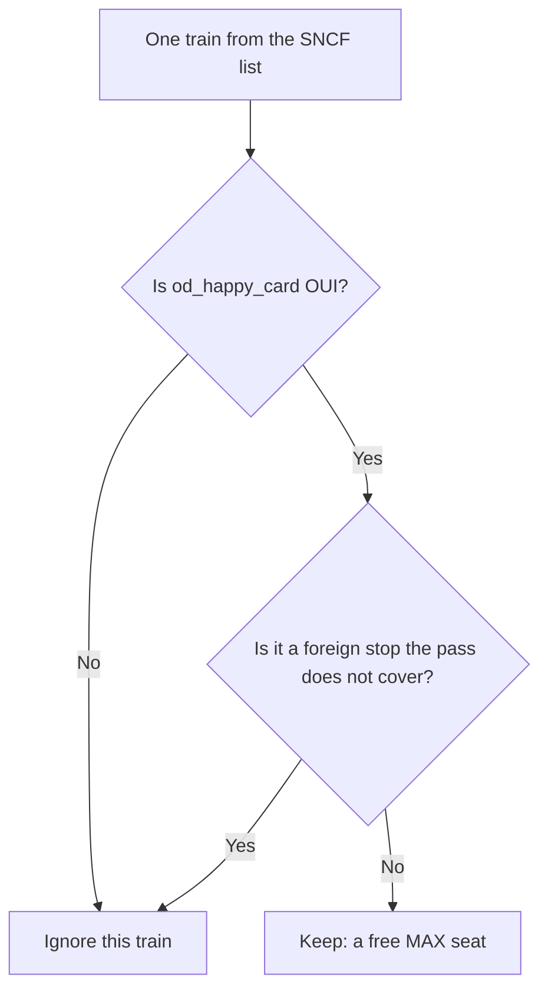
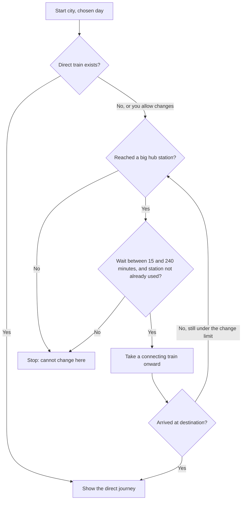
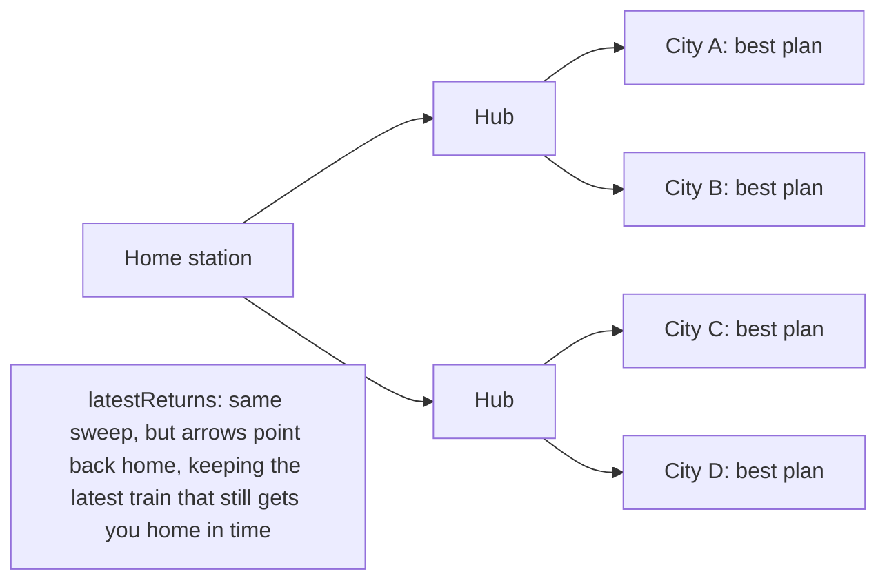
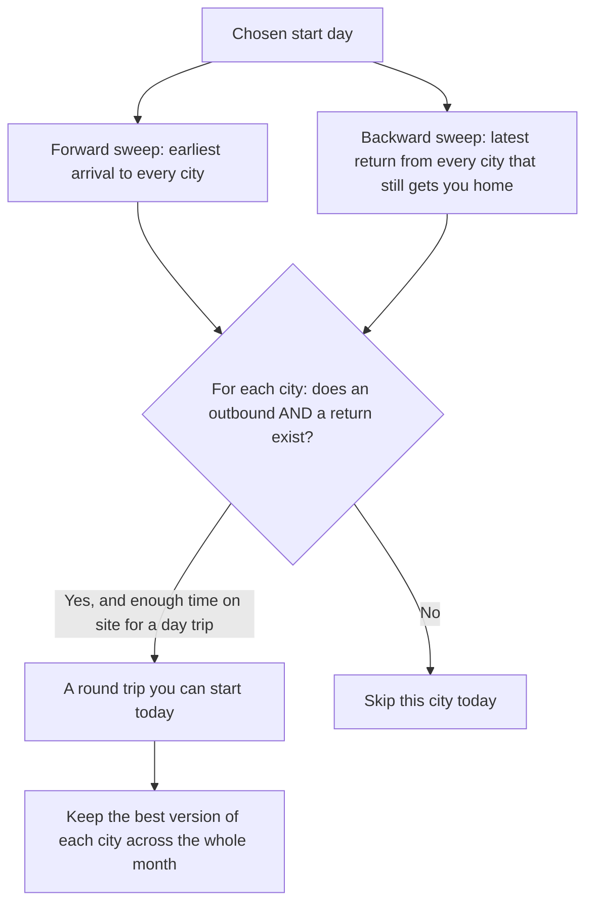
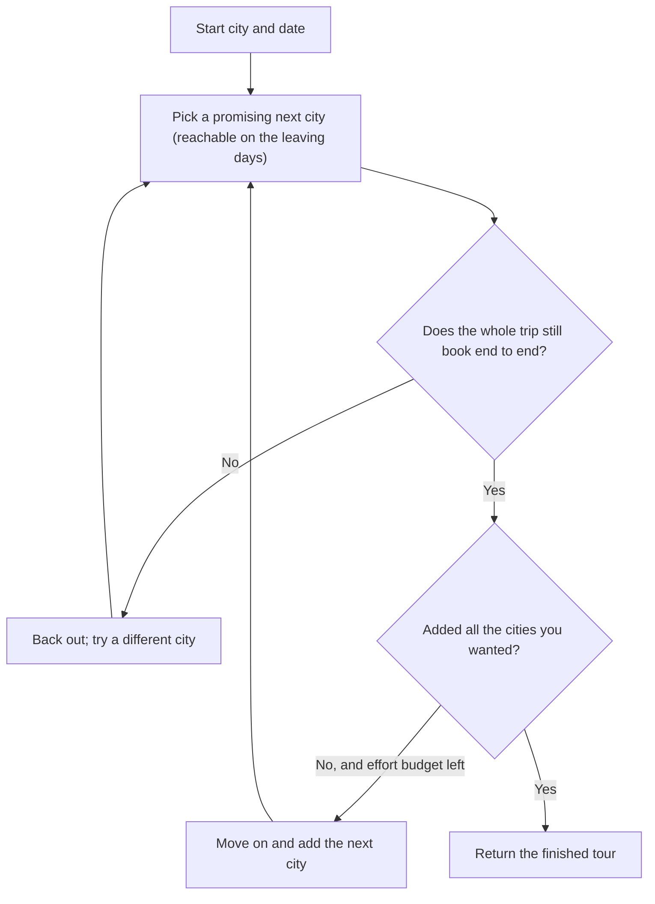
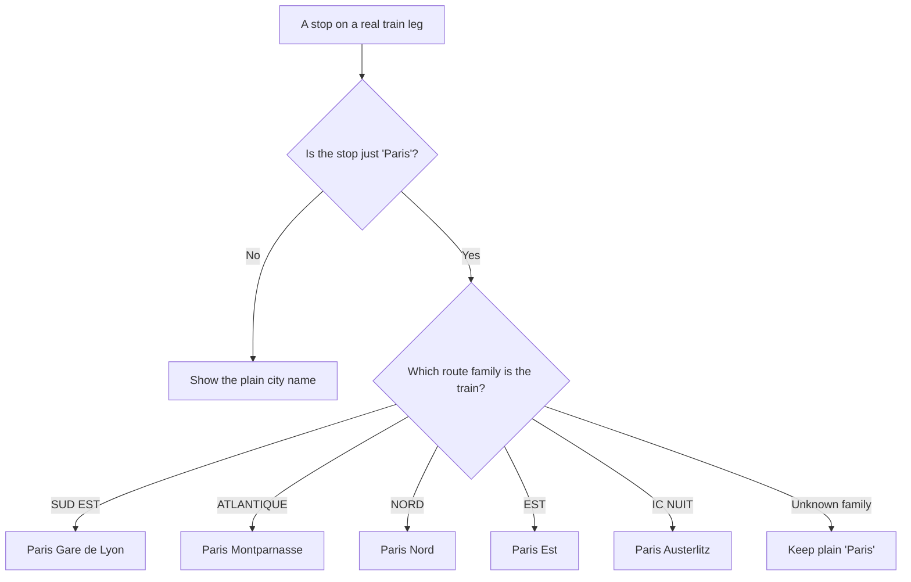

# How MAX Finder finds your trains

MAX Finder helps people with an SNCF "MAX JEUNE" or "MAX SENIOR" pass find trains where a reserved seat costs nothing extra. This page explains, in plain words, how the app decides which trains to show you and how it strings them into trips. No maths, just everyday pictures. Each section has a one-line intro, a real-world analogy, the actual steps, and a small diagram.

---

## 1. Spotting the free-seat trains

**In one line:** Before anything else, the app throws away every train where a free MAX seat is *not* available, and keeps only the ones you can actually book.

**Analogy:** Think of a huge noticeboard covered in train listings. Most of them have a little "SOLD OUT for pass holders" sticker. You only care about the ones with a green "free seat here" sticker, so you cover your eyes to all the rest and read only the green ones.

**How it works, step by step:**

- The SNCF data gives every train one label called `od_happy_card`. It reads either `"OUI"` (yes, a free MAX seat can be reserved) or `"NON"` (no).
- The app marks a train as **available** only when that label is exactly `"OUI"`.
- There is one extra safety check. A few trains to places abroad (like Genève, Lausanne, Zurich or Bruxelles) can show `"OUI"` in the raw feed, but the MAX pass does not really cover them. The app treats those as *not* bookable so you are not misled.
- Every search you do starts from this filtered pool of green-sticker trains. A train that is not available is simply never considered.

---

## 2. Building a journey — direct, or one change at a big hub

**In one line:** If there is no single train from A to B, the app tries to chain two or three trains together, but only by changing at a major station and only with a sensible wait.

**Analogy:** Imagine planning a trip with a paper timetable when there is no direct train. You trace it by hand: "take this train to a big junction like Paris or Lyon, then hop on a connecting train onward." You only allow yourself to change at *big* stations, you insist the wait is not too short to make the change and not so long you are stuck all day, and you never pass back through a station you already visited.

**How it works, step by step:**

- **Direct first.** The app looks for a single train that goes straight from where you are to where you want to go, leaving on your chosen day inside your time window.
- **Then connections.** If you allow changes, it also tries chains of trains. Each change has three firm rules:
  - You may only change at one of **10 major hub stations** (Paris, Lyon, Lille, Marseille, Bordeaux, Rennes, Strasbourg, Nantes, Montpellier, Toulouse).
  - The wait between trains must be **at least 15 minutes** (enough time to actually make it) and **at most 240 minutes**, which is 4 hours (so you are not stranded).
  - You never pass through the same station twice.
- **How many changes?** By default it allows **one** change. You can ask for zero (direct only) or up to a few changes.
- **Crossing midnight is handled correctly.** The app measures time on one long continuous ruler rather than a 24-hour clock. So a train arriving at 23:50 can connect to one leaving at 00:20 the next morning, and the app correctly sees that as a 30-minute wait, not a negative one.
- It explores every possible chain of trains that obeys these rules (this exhaustive trying is called a "search"), then sorts the results by departure time.

---

## 3. The "one sweep to everywhere" trick

**In one line:** Instead of asking "can I get to city X?" over and over for every city, the app answers "where can I get to, and what is the best plan for each?" all in a single pass.

**Analogy:** You are standing at your home station. You could pull out the timetable, look up Lyon, put it away, pull it out again, look up Marseille, put it away, and so on for a hundred cities — reading the whole timetable a hundred times. Or you could read the timetable *once*, spreading outward from home like ripples in a pond, and jot down the best way to reach each place as you go. The second way is the same effort as one lookup but answers all of them. That is the sweep.

**How it works, step by step:**

- **The forward sweep** (called *reachableJourneys*) starts at your origin and fans outward through the timetable in one search. Every station it reaches becomes a possible destination, and for each one it remembers the single best journey found. It obeys the exact same connection rules as section 2 (hubs only, sensible waits, no station twice).
- "Best" can mean two things. Normally it keeps the **fastest** journey to each place. For round-trip ideas it instead keeps the journey that **arrives soonest**, so you get the most time at your destination.
- **The backward twin** (called *latestReturns*) does the mirror image for the trip home. It works backwards from your home city and, for every place you might be coming from, keeps the return train that leaves **as late as possible** while still getting you home by a deadline. This lets it find "stay as long as you can, then come home" for every city at once.
- **Why sweep once?** Checking every city one by one means re-reading the whole timetable for each city. One sweep reads it a single time and answers them all — dramatically faster when you want the whole map lit up, like the "Ideas" screen.
- Both sweeps drop the starting point from their answer (you never "travel" to where you already are), and both remember their results so repeat views are instant.

---

## 4. Round trips and a month of ideas

**In one line:** A round trip pairs the earliest-arriving train out with the latest train back you can still catch, and the app can price out a whole month of these getaways cheaply.

**Analogy:** Planning a day out, you naturally want to arrive as early as you can and leave as late as you can — squeezing the most time out of the place. Working out the trip home, you look at trains into your home city and count backwards: "what is the latest I can leave and still be home by midnight?" The app does exactly this, for every possible city at once.

**How it works, step by step:**

- **The core rule: maximise your time there.** The app always picks the outbound that *arrives soonest* and pairs it with the *latest feasible return*. Note this is earliest arrival, not fastest ride — a slightly longer train that lands sooner beats a quicker one that lands later.
- **Three shapes of trip:**
  - **Day trip (0 nights):** out in the morning, home the same evening. To stop pointless "arrive at 4pm, leave at 4:30pm" non-trips, a day trip only counts if you get **at least 4 hours** on site (this minimum can be adjusted). Home must be by midnight, or by roughly 02:00 with the "late return" option.
  - **Multi-night stay (N nights):** the return simply leaves N days later. There is no minimum-hours gate — you are staying over, so any return time is fine.
  - **Sleeper round trip:** you ride an overnight sleeper *both* ways. Because a sleeper leaves in the evening and arrives the next morning, there is never a same-day option (always at least one night), and the return leaves the evening *after* your last night, landing the following midday.
- **Flexible nights:** if you say "up to 3 nights," the app tries the longest stay first and keeps whichever city gives you the most nights that actually works.
- **A month of ideas, fast:** naively, checking each city on each day would be a search per city per day. Instead, for each day the app runs just **two sweeps** (from section 3): one forward for all the outbounds, one backward for all the latest returns. It then simply matches them up by city. That turns a search-per-city into a pass-per-day.

---

## 5. The Tour builder

**In one line:** For a multi-city trip, the app tries a route, backs out of dead ends, keeps you 1–3 days in each city, and can flex your start date earlier or later.

**Analogy:** A travel agent building your trip one city at a time. At each step they list the places you could actually reach on the days you would be leaving, pencil in the most promising one, and check the whole trip still books end to end. If a choice leads to a dead end, they rub it out and try another — always keeping the best partial trip they managed so far.

**How it works, step by step:**

- **One shared scheduling engine.** For any fixed order of cities, the app books each hop by searching that hop's allowed days for the earliest workable free-MAX journey, then moves the window forward to "arrival plus your minimum stay" up to "arrival plus your maximum stay" before the next hop.
- **Staying 1–3 days per city.** The minimum stay is always at least 1 day, and the maximum is never below the minimum (even if you type the numbers the wrong way round).
- **Choosing the order:**
  - **5 cities or fewer:** it tries *every* possible order and keeps the fastest overall.
  - **More than 5 cities:** trying every order would explode, so it uses a "nearest sensible next stop" approach instead, chaining to the closest reachable city each time.
  - **A fixed order:** it can also just honour the exact order you gave.
- **The interactive builder (backtracking search).** Behind the "Nearest stop" and "Surprise me" buttons, the app grows your trip one city at a time. For each new city it only proposes places you could actually reach on the days that hop would leave. After adding a city it re-checks that the whole trip still books; if it no longer does, it drops that choice and backs out — this is the backtracking. It keeps going until it has added all the cities you asked for, or until it hits its built-in effort limit, so it always answers promptly.
- **Flexible start date, both directions.** Your first departure can slide a few days *earlier or later* than the date you picked, so the trip is not stuck on a day with no service. The one hard wall: it will never depart before today — you cannot travel in the past.

---

## 6. Naming the exact Paris gare

**In one line:** On a real journey leg, when a stop is just "Paris," the app names the specific Paris station from the train's route family — but other big cities keep their plain name.

**Analogy:** "Paris" is not one station. A ticket that just says "Paris" is like a parcel addressed to a whole neighbourhood. But every train belongs to a route family (its "axe"), and that family tells you exactly which of Paris's terminals it uses — the way knowing a bus is the "airport line" tells you which stop it leaves from. So the app fills in the precise gare. For Lyon or Lille, the data does not pin down a single station reliably, so it politely leaves the plain city name.

**How it works, step by step:**

- The app looks at each end of a real train leg. If the stop is not the "Paris" aggregate, it just shows the plain city name and stops.
- If the stop *is* "Paris," it reads the train's route family (its `axe`) and maps it to the matching gare:
  - **SUD EST** → Paris Gare de Lyon
  - **ATLANTIQUE** → Paris Montparnasse
  - **NORD** → Paris Nord
  - **EST** → Paris Est
  - **IC NUIT** (the overnight sleeper) → Paris Austerlitz
- If the route family is one it does not recognise (like IC ARO or INTERNATIONAL), it does not guess — it keeps the plain "Paris" label.
- This precise naming only happens on concrete journey legs, where the train (and so its route family) is known. In the broad browse lists, many route families mix together under a single "Paris," so it deliberately stays generic there.

