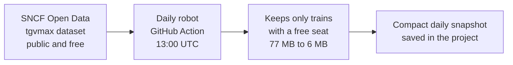
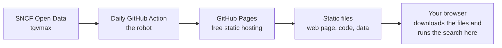
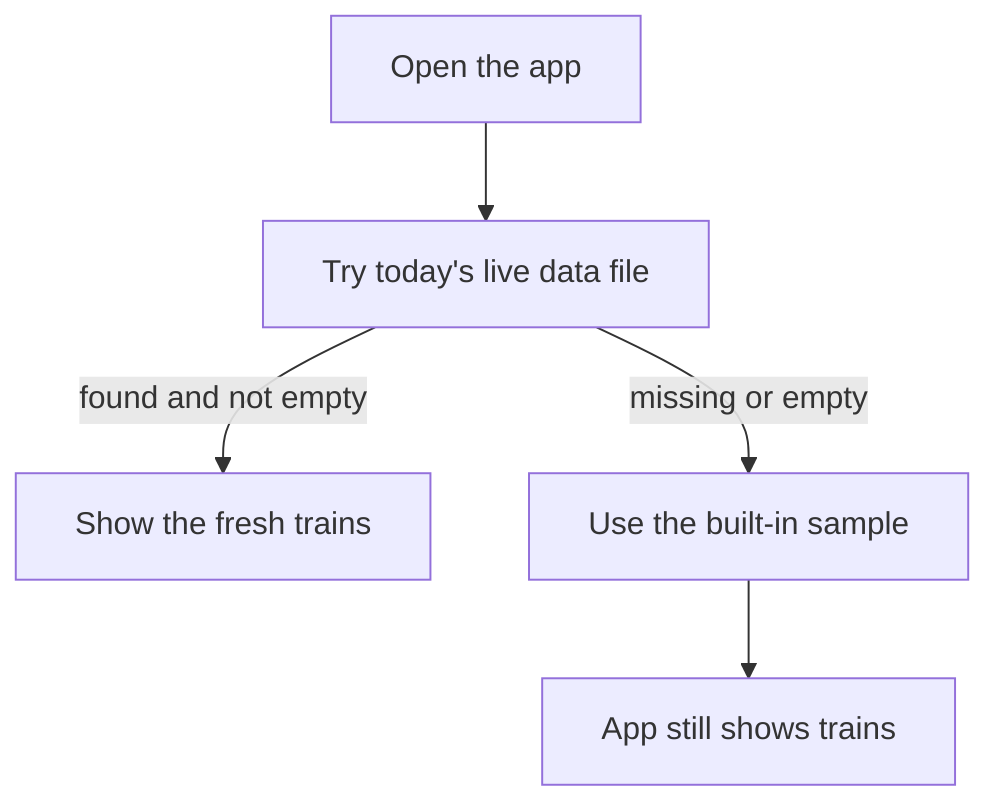
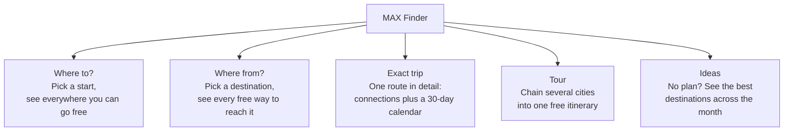

# How MAX Finder Works

A friendly tour of what this little app does, where its train data comes from, and why it can run for free forever without a server or an account.

---

## The problem it solves

If you hold an SNCF **MAX JEUNE** or **MAX SENIOR** pass, you can ride certain high-speed trains for free — but only if there's a special "MAX" seat still open on that train. The catch: normally you'd have to poke at the SNCF Connect booking site one station pair at a time ("Paris to Lyon? Paris to Bordeaux? Paris to Nantes?…") just to discover *where* those free seats even exist.

MAX Finder flips that around. Instead of you guessing routes, it already knows every train with a free reservable seat and lets you ask big, open questions like:

> "From my city, where can I go for free this weekend?"

No station-by-station probing. You pick a starting point, and the whole map lights up.

---

## Where the data comes from (and how it stays fresh)

All the train information comes from a free public dataset published by **SNCF** (the French national railway). It is called **tgvmax**, officially *"Disponibilité à 30 jours de places MAX JEUNE et MAX SENIOR"* — in plain terms, "which free MAX seats are reservable over roughly the next 30 days."

A few nice things about this source:

- It's **open and public** (published under France's *Licence Ouverte*), so no password, no API key, and nothing to pay for.
- Each entry is simple: a date, an origin station, a destination, departure and arrival times, the train number, and a yes/no flag saying whether a free MAX seat can actually be reserved on it.
- It covers about **30 days** ahead — which is exactly why the app shows a 30-day availability calendar. MAX seats only open up about a month out.

**How it stays fresh:** every day, an automated robot on GitHub (a scheduled job called a "GitHub Action") wakes up, downloads a brand-new copy of the SNCF dataset, and files it away. Think of it as a clipping service: each morning it buys the whole newspaper, cuts out only the train listings you can actually book, and pins that short list to a shared board.

The robot runs at **13:00 UTC**, timed to land just *after* SNCF's own once-a-day midday refresh. Checking more often would just re-download the same numbers, so once a day is exactly right. And if the download ever fails, the robot refuses to overwrite the good copy — yesterday's clippings simply stay on the board.

One clever trim: the full SNCF file is about **77 MB**, and roughly 90% of it is trains with *no* free seat — stuff the app never shows. So the robot keeps only the ~10% of rows where a MAX seat is truly reservable (the ones flagged "OUI"), shrinking the file from about 77 MB down to about **6 MB**. That's the difference between a phone loading it smoothly and a phone hanging.

---

## How it runs for free, forever — no server, no account

Here's the part that keeps it truly free: **there is no back-end and no login.** MAX Finder is just a bundle of ordinary files — a web page, some code, and that daily data file — parked on **GitHub Pages**, GitHub's free static-file hosting.

When you open the site, *your own browser* downloads the data file and does **all** the searching right there on your device. Nothing you type is sent off to some computer in a data centre. Compare the two shapes:

- **A traditional app:** your browser → a company's server → a database → back to you. Someone pays for that server every month.
- **MAX Finder:** your browser → a static file on free hosting → and the searching happens on your own device.

Because there's no server to keep running, there's nothing to pay for and nothing that can quietly shut down when the bill isn't paid.

**Publishing safely.** A second robot rebuilds and re-publishes the site 30 minutes after the data refresh (at **13:30 UTC**). Before anything goes live, it opens the freshly built app in an invisible test browser and loads three key screens — the home page, an exact trip, and a tour — to check they actually appear. If a build would show a blank page, it fails the check and is never published — so a broken version can't reach you.

**Works offline.** The app installs a quiet background helper called a **service worker** — imagine a diligent librarian who keeps a personal copy of the app and the latest listings. It always checks for a newer edition first, but if you're on a plane or underground with no signal, it serves the copy it saved. It also carefully labels each edition (internally, "maxjeune-v7") and throws out the previous one, so you never get stuck reading a stale, broken copy.

**Always shows something.** A small sample set of trains is baked right into the app. If the live data file is ever missing or empty, the app quietly falls back to that sample — like a vending machine with a small emergency tray inside, so it's never completely empty when the delivery truck is late.

---

## The five things you can do

MAX Finder gives you five ways to explore the same pool of free seats. Pick one from the tabs and fill in a station or two.

### 1. Where to?
Choose your home station and see **every place you can reach for free** on a chosen day. Each destination also shows how many days in the coming month it has a free seat, so the recommended order surfaces the best-served spots first. If a place needs a change of train at a big hub, it's added too.

### 2. Where from?
The mirror image. Choose a **destination**, and it shows every origin that can get you there for free. Handy when you know where you want to end up but not where to start.

### 3. Exact trip
Zoom into **one specific route** — say, your town to the coast. You get any needed connections, a **30-day availability calendar** so you can spot the good dates at a glance, and an optional return leg ("Do you want to come back?").

### 4. Tour
String **several cities into one trip**. You start somewhere, visit a few places (staying a chosen number of days in each), and optionally finish at a fixed city by a target date. The app works out a sensible order and finds a free leg for each hop. Two buttons help you build it: "nearest stop" adds the closest sensible next city, and "Surprise me" adds a random one.

### 5. Ideas
For when you have **no fixed plan**. Pick just a starting city and it lists the best destinations — shown fastest-first, each with a count of how well-served it is across the whole booking window. Click a day on the calendar to narrow it down.

### Two toggles that ride on top

- **Round trip** (available in *Where to?* and *Ideas*): turns the destination list into there-and-back trips. It always aims to give you the most time at your destination — the **earliest-arriving** train out, paired with the **latest** train home that still gets you back in time. You can do same-day day trips (with a minimum on-site time so a pointless 20-minute visit doesn't count) or stays of up to a few nights.
- **Night trains** (excluded by default — flip the toggle on to include them): a train counts as a genuine overnight sleeper only when it's a real *Intercités de Nuit* service — not just any train that happens to leave late. Once night trains are switched on, a nested **"Only night trains"** option narrows results to trips you actually sleep aboard.

---

## Your privacy

MAX Finder is private by design, because there's simply nowhere for your information to go.

- Your **pass type, language, theme, favourite routes, saved trips, and watched routes** are stored only in your browser (in local storage on your own device). They never leave it. If you clear your browser data, they're gone — that's the only way they leave.
- Because there's no server and no account, there's nothing to log in to and no profile being built about you.
- A search is just a **shareable link**. Every choice you make is written into the web address, so you can bookmark a search or send it to a friend, and it reopens to the exact same results. Nothing about *you* is in that link — only the search itself.

That's the whole idea: a fast, free way to find trains you can actually book — running entirely in your pocket, owing nobody a monthly bill, and keeping your plans to yourself.
